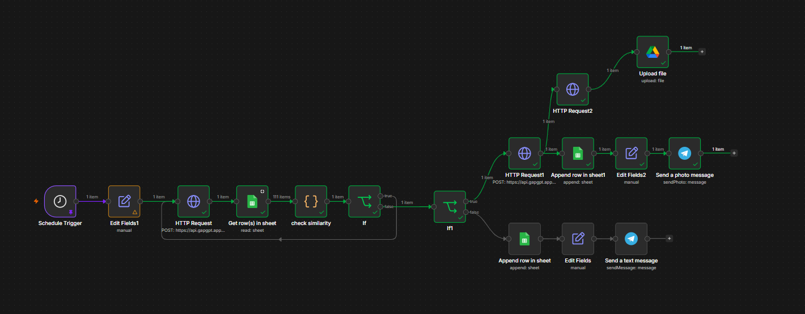

# AI-Powered Telegram Content Automation

  

  <strong>AI-powered automated content generation and publishing system for Telegram</strong>

  <a href="https://t.me/outstandingwords">📢 Telegram Channel</a>

---

## Overview

An AI-powered Telegram content automation system built with n8n, DeepSeek, Google Sheets, Z-Image, and Telegram Bot API.

This project automates the complete content production and publishing pipeline for a Persian Telegram channel. It generates meaningful content, checks for duplicate or highly similar posts, generates contextual AI images when required, stores publishing history, and automatically publishes the final content to Telegram.

## Features

- AI-powered Persian content generation
- Automated Telegram publishing
- Five scheduled posts per day
- Automatic text/image post selection
- Duplicate content detection
- Similarity analysis
- Recent author diversity control
- Google Sheets publishing database
- Context-aware AI image generation
- Dynamic image prompts
- Automatic regeneration of rejected content
- Structured JSON output
- Custom JavaScript workflow logic

## Content Strategy

The system uses a diversified content strategy instead of generating only generic motivational quotes.

Target content distribution:

| Content Type | Target |
|---|---:|
| Famous quotes | 35% |
| Book excerpts | 15% |
| Movie / TV dialogues | 15% |
| Poetry | 15% |
| Debates / speeches / conversations | 10% |
| Songs / lyrics | 10% |

The generated content focuses on meaningful and thought-provoking themes such as:

- Love
- Life
- Death
- God
- Humanity
- Freedom
- Loneliness
- Hope
- Philosophy
- Suffering
- Choice
- Failure
- Victory
- Time
- Courage

The maximum generated content length is 65 words.

## Workflow Architecture

The workflow follows this general architecture:

Schedule Trigger → Edit Fields → DeepSeek → Google Sheets → Check Similarity → Duplicate Decision → Post Type Decision → Image/Text Branch → Telegram

If the generated content is considered a duplicate, the workflow returns to DeepSeek and generates new content.

## Publishing Schedule

The system publishes five posts per day.

| Time | Post Type |
|---|---|
| 08:00 | Image |
| 12:00 | Text |
| 15:30 | Text |
| 18:30 | Image |
| 21:30 | Text |

The post type is automatically determined from the scheduled execution time.

## Technology Stack

| Technology | Purpose |
|---|---|
| n8n | Workflow automation |
| DeepSeek | AI content generation |
| GapGPT API | API gateway |
| Google Sheets | Publishing history |
| Z-Image | AI image generation |
| Telegram Bot API | Content distribution |
| JavaScript | Similarity detection and workflow logic |

## DeepSeek

DeepSeek is responsible for generating and structuring the content.

The model is instructed to:

- Generate meaningful content
- Avoid generic motivational clichés
- Avoid fabricated quotations
- Maintain source diversity
- Avoid recently used authors
- Avoid repetitive content
- Generate an image prompt for image posts
- Return structured JSON

Expected output structure:

{
  "quote": "Selected content",
  "author": "Author or source",
  "image_prompt": "English image generation prompt"
}

For text posts, the image_prompt field is returned as an empty string.

## Google Sheets Database

Google Sheets is used as the publishing history database.

The database stores previously published content.

Example structure:

| Column | Description |
|---|---|
| متن | Published content |
| گوینده | Author or source |
| تاریخ | Publishing date |

The database allows the workflow to compare newly generated content with previously published content.

## Duplicate Detection

Before publication, the generated content is passed through a custom JavaScript similarity checker.

The process:

1. Parse the DeepSeek JSON response.
2. Normalize Persian characters.
3. Remove unnecessary punctuation.
4. Normalize whitespace.
5. Compare the new content against stored content.
6. Calcu

late similarity.
7. Check recent author usage.
8. Decide whether the generated content should be accepted or rejected.

The current target similarity threshold is 90%.

If the similarity reaches or exceeds the configured threshold, the content is rejected and regenerated.

## Author Diversity

The system does not permanently ban authors.

Instead, it is designed to prevent an author from appearing repeatedly within a recent rolling window.

For example, an author may appear again after enough other posts have been published.

This allows the system to maintain variety while still allowing important authors and sources to return naturally.

## Post Type Detection

The workflow automatically determines whether a post should be an image or text post.

The current logic is:

{{ [8, 18].includes($now.hour) ? "تصویری" : "متنی" }}

This means:

- 08:00 → Image
- 18:30 → Image
- 12:00 → Text
- 15:30 → Text
- 21:30 → Text

## AI Image Generation

For image posts, DeepSeek generates a dedicated English image prompt based on the meaning and emotional context of the selected content.

The image prompt is generated dynamically for every image post.

It can describe:

- Main subject
- Environment
- Emotional atmosphere
- Visual metaphor
- Human behavior
- Lighting
- Camera perspective
- Composition
- Depth of field
- Environmental details

The generated prompt is then passed directly to Z-Image.

## Image Generation Requirements

The image-generation prompt is designed to produce:

- Ultra-realistic images
- Photorealistic scenes
- Cinematic composition
- Natural lighting
- Realistic materials
- Physically accurate anatomy
- Realistic depth of field
- Emotional storytelling
- Clear visual connection to the quote

The prompt also instructs the image model to avoid:

- Text
- Typography
- Captions
- Logos
- Watermarks
- Generic stock-photo appearance
- Unrelated objects
- Random scenery
- Artificial-looking AI elements

## Z-Image

The image generation system uses Z-Image through the configured API.

Configuration:

- Model: gapgpt/z-image
- Resolution: 1024x1024

The image prompt is passed dynamically from the DeepSeek result rather than using a fixed prompt.

This allows every generated image to be visually related to its corresponding content.

## Telegram Publishing

After content generation and validation, the workflow automatically publishes the result to the configured Telegram channel.

Text posts contain the generated content and relevant hashtags.

Image posts contain the generated image together with the related content.

## Regeneration Logic

The workflow contains an automatic regeneration loop.

If the similarity checker determines that the generated content should be rejected:

Duplicate → DeepSeek → Generate New Content → Similarity Check

If the content passes validation:

Duplicate = False → Continue → Publish

This creates an automated quality-control layer before publication.

## Installation

### Requirements

You need:

- n8n
- DeepSeek-compatible API access
- Telegram Bot
- Telegram Channel
- Google account
- Google Sheets
- Z-Image API access

### Import the Workflow

Import the provided n8n workflow JSON into your n8n instance.

Then configure the required credentials and connections.

### Configure DeepSeek

Configure the DeepSeek HTTP Request node with the required API credentials.

Current model:

deepseek-v4-flash

### Configure Google Sheets

Create a spreadsheet containing the publishing history.

Recommended columns:

متن | گوینده | تاریخ

Connect the Google Sheets credential to n8n.

### Configure Telegram

Create a Telegram bot using BotFather.

Add the bot as an administrator of the target Telegram channel.

Configure the Telegram nodes with the appropriate credentials and channel identifier.

### Configure Z-Image

Configure the image-generation HTTP Request node.

The image prompt must be received dynamically from the DeepSeek output.

Do not replace the dynamic image prompt with a static prompt.

## Security

Never commit API keys, bot tokens, or private credentials to GitHub.

Before committing an

exported n8n workflow:

- Remove API keys
- Remove Telegram bot tokens
- Remove private credentials
- Remove personal information
- Review the exported JSON
- Use n8n credentials where possible

Never publish real credentials inside the repository.

## Project Structure

The repository can be organized as follows:

ai-telegram-automation-n8n/
├── README.md
├── workflow/
│   └── telegram-automation.json
├── docs/
│   └── architecture.md
└── screenshots/
    └── workflow.png

The repository structure may evolve as the project develops.

## Current Status

### Completed

- [x] Telegram bot configuration
- [x] Telegram channel integration
- [x] Automated scheduling
- [x] DeepSeek integration
- [x] Structured JSON generation
- [x] Google Sheets integration
- [x] Duplicate detection
- [x] Image/text branching
- [x] Z-Image integration
- [x] Dynamic image prompts
- [x] Telegram publishing
- [x] Automatic regeneration logic

### Planned Improvements

- [ ] Advanced semantic similarity detection
- [ ] Improved author rotation
- [ ] Stronger source verification
- [ ] Content quality scoring
- [ ] Analytics
- [ ] Engagement-based optimization
- [ ] Production monitoring
- [ ] Automatic performance analysis

## Future Improvements

### Semantic Similarity

The current similarity system uses word-based comparison.

A future version could use semantic embeddings to identify content that is conceptually similar even when the wording is significantly different.

Potential technologies include:

- Sentence Transformers
- Embedding APIs
- Vector databases

### Source Verification

A future version could introduce an external verification layer to reduce incorrectly attributed quotations, dialogues, literary excerpts, and historical statements.

### Smarter Author Rotation

The author diversity system can be improved using a configurable rolling history.

This would allow the system to dynamically determine which authors have appeared recently and prioritize less recently used sources.

### Content Quality Scoring

Each generated post could receive scores for:

- Originality
- Emotional impact
- Depth
- Relevance
- Authenticity
- Audience appeal

Only content above a configurable quality threshold would be published.

### Analytics

Future versions could collect:

- Views
- Reactions
- Shares
- Engagement rate
- Best-performing content types
- Best-performing authors
- Best publishing times

The collected data could eventually be used to automatically optimize the publishing strategy.

## Learning Objectives

This project serves as a practical learning project covering:

- Workflow automation
- API integration
- Prompt engineering
- AI content generation
- Structured AI outputs
- JavaScript
- Data processing
- Duplicate detection
- Conditional workflows
- Error handling
- AI image generation
- Telegram automation
- System architecture

## Why This Project?

This project demonstrates how multiple AI and automation technologies can be combined into a practical autonomous content pipeline.

The core architecture combines:

AI Generation + Quality Control + Data Storage + AI Image Generation + Automation + Distribution

The result is a system capable of generating, validating, enriching, and publishing content with minimal manual intervention.

## Disclaimer

AI-generated content may contain factual or attribution errors.

Although the system uses prompt constraints and duplicate detection to improve reliability, it should not be considered a perfect source-verification system.

Important quotations, literary excerpts, movie dialogues, lyrics, and historical statements should be independently verified before publication.

Copyright restrictions may apply to books, movies, songs, and other copyrighted works. The project should be operated in accordance with applicable laws and platform policies.

## Author

Built as an independent AI and automation engineering project.

AI + Automation + APIs + Data + Content Distribution

## License

This project is provided for educational and portfolio purposes.

If an open-source license is added to the rep

ository, this section should be updated accordingly.
